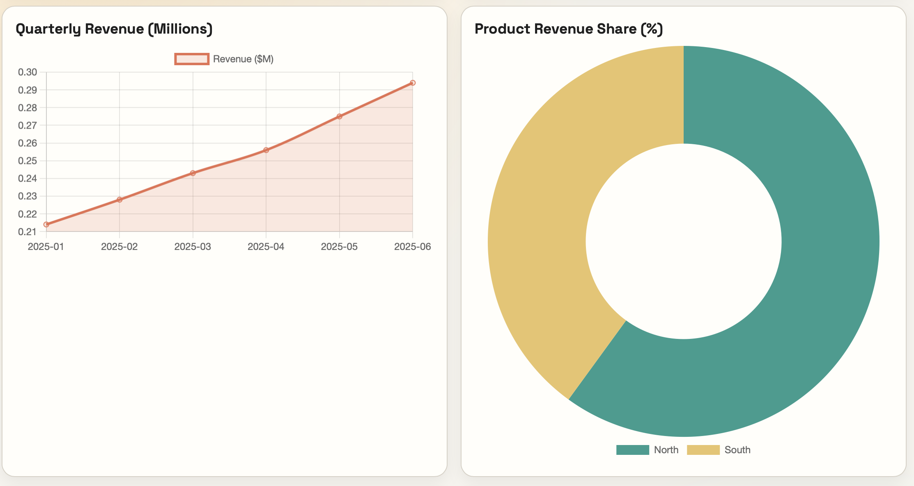
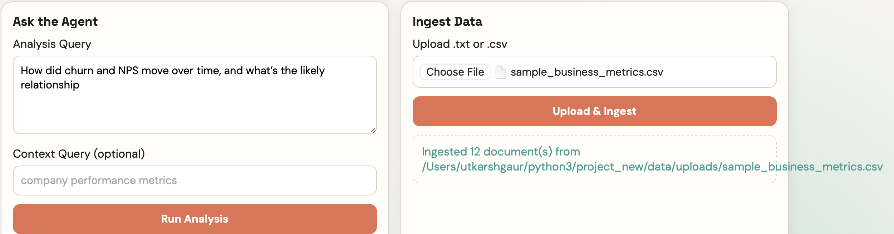
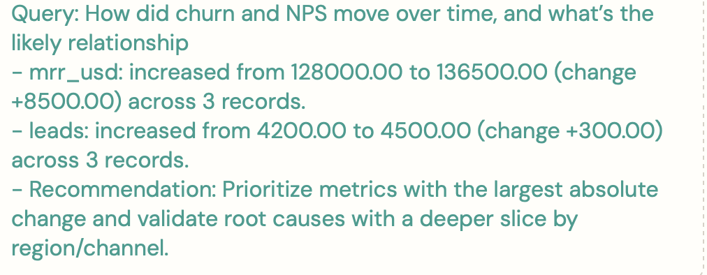

# RAG + Agentic AI Analytics Dashboard

An end-to-end AI analytics project that combines Retrieval-Augmented Generation (RAG), agent-style reasoning, and a live dashboard for data insights from uploaded CSV/TXT files.

## Highlights
- RAG pipeline with semantic retrieval path and local lexical fallback
- Agent-based analysis with provider abstraction
- FastAPI backend with upload, context retrieval, analysis, and stats endpoints
- Frontend dashboard with KPI cards and charts
- Quota-aware behavior with deterministic local fallback mode

## Screenshots

Add your images in the `screenshots` folder and keep/replace these paths.






If you use different names, just update these links.

## Tech Stack
- Python 3.12
- FastAPI + Uvicorn
- LangChain
- Google Gemini (current default), DeepSeek/Ollama paths supported in code
- Weaviate integration path + local fallback retrieval
- Pandas + NumPy
- Vanilla HTML/CSS/JS + Chart.js

## Project Structure

```text
project_new/
├── src/
│   ├── config.py
│   ├── embeddings.py
│   ├── rag_pipeline.py
│   ├── tools.py
│   ├── agent.py
│   ├── backend_server.py
│   └── main.py
├── frontend/
│   ├── index.html
│   ├── styles.css
│   ├── app.js
│   └── server.py
├── data/
│   ├── sample_business_metrics.csv
│   └── uploads/
├── screenshots/
├── .env.example
├── requirements.txt
└── README.md
```

## Quick Start

### 1) Create environment

macOS/Linux:

```bash
python3.12 -m venv .venv312
source .venv312/bin/activate
```

PowerShell:

```powershell
py -3.12 -m venv .venv312
.\.venv312\Scripts\Activate.ps1
```

### 2) Install dependencies

```bash
pip install --upgrade pip setuptools wheel
pip install -r requirements.txt
```

### 3) Configure environment variables

```bash
cp .env.example .env
```

Set at least:
- `LLM_PROVIDER=google`
- `GOOGLE_API_KEY=...`
- `MODEL_NAME=gemini-2.0-flash`
- `EMBEDDING_PROVIDER=local`

### 4) Start backend API

```bash
./.venv312/bin/python -m uvicorn backend_server:app --app-dir src --host 0.0.0.0 --port 8000
```

### 5) Start frontend

```bash
cd frontend
python server.py
```

### 6) Open app
- Frontend: `http://localhost:3000`
- API health: `http://localhost:8000/health`

## API Endpoints
- `GET /health`
- `GET /api/stats`
- `GET /api/context?query=...`
- `POST /api/analyze`
- `POST /api/ingest`

## Sample cURL Commands

```bash
curl -s http://localhost:8000/health
curl -s http://localhost:8000/api/stats
curl -s "http://localhost:8000/api/context?query=revenue%20trend"
curl -s -X POST http://localhost:8000/api/analyze \
  -H "Content-Type: application/json" \
  -d '{"query":"Summarize revenue trend with numbers.","context_query":"mrr revenue churn"}'
```

## Notes for Recruiters/Reviewers
- The system is built with reliability in mind: retrieval fallback and quota fallback reduce hard failures.
- Uploaded CSV files drive both chart updates and analysis context.
- Provider settings are env-driven, so model/backend switching does not require core code changes.

## Interview Docs
- Detailed project guide: `INTERVIEW_PROJECT_GUIDE.md`
- Quick revision sheet: `INTERVIEW_REVISION_SHEET.md`

## License
MIT
