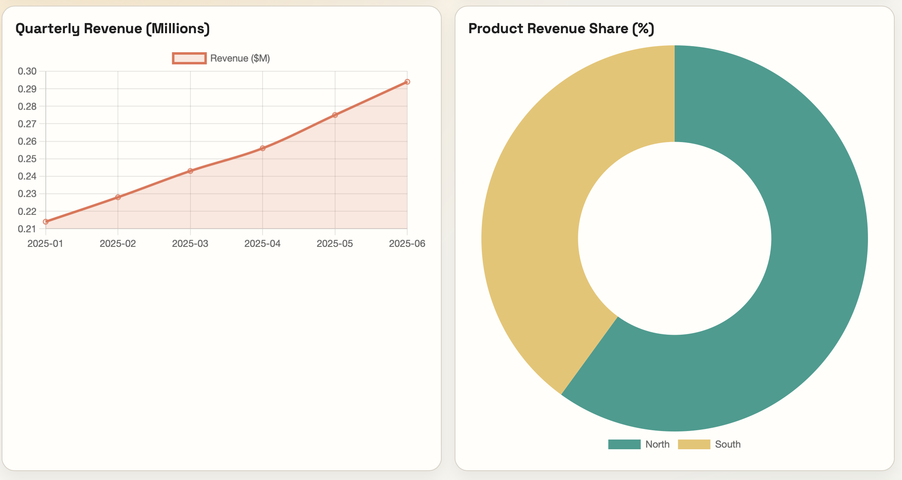
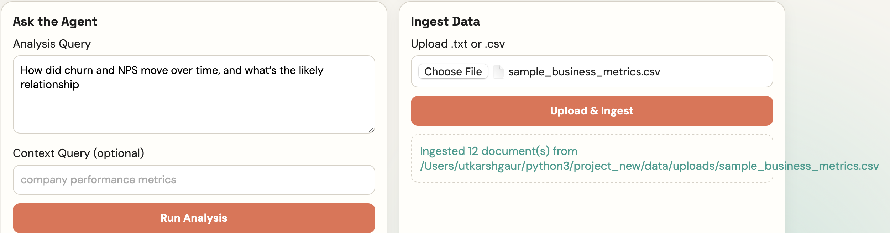
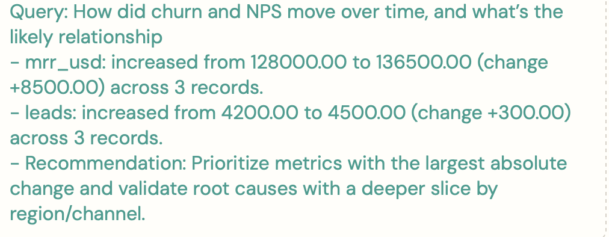

# RAG + Agentic AI Analytics Dashboard

An end-to-end AI analytics project that combines Retrieval-Augmented Generation (RAG), agent-style reasoning, and a live dashboard for data insights from uploaded CSV/TXT files.

## Highlights
- RAG pipeline with semantic retrieval path and local lexical fallback
- Agent-based analysis with provider abstraction (LLM: Ollama/Qwen2:7b)
- **NEW: CSV File Context** - Ask the Agent section now accepts uploaded CSV files for data-aware analysis
- FastAPI backend with upload, context retrieval, analysis, and stats endpoints
- Frontend dashboard with KPI cards, charts, and period-based data visualization
- Exact data extraction: Agent analyzes files and provides precise, data-driven responses
- Quota-aware behavior with deterministic local fallback mode

## Screenshots

Add your images in the `screenshots` folder and keep/replace these paths.






If you use different names, just update these links.

## Tech Stack
- Python 3.12
- FastAPI + Uvicorn
- LangChain + LangGraph
- **LLM: Ollama/Qwen2:7b** (local model, 7B parameters, optimized for data analysis)
- Weaviate integration path + local fallback retrieval
- Pandas + NumPy
- Vanilla HTML/CSS/JS + Chart.js
- PostgreSQL 16 (optional session state storage)

## Project Structure

```text
project_new/
├── src/
│   ├── config.py
│   ├── embeddings.py
│   ├── rag_pipeline.py
│   ├── tools.py
│   ├── agent.py
│   ├── backend_server.py
│   └── main.py
├── frontend/
│   ├── index.html
│   ├── styles.css
│   ├── app.js
│   └── server.py
├── data/
│   ├── sample_business_metrics.csv
│   └── uploads/
├── screenshots/
├── .env.example
├── requirements.txt
└── README.md
```

## Quick Start

### 1) Create environment

macOS/Linux:

```bash
python3.12 -m venv .venv312
source .venv312/bin/activate
```

PowerShell:

```powershell
py -3.12 -m venv .venv312
.\.venv312\Scripts\Activate.ps1
```

### 2) Install dependencies

```bash
pip install --upgrade pip setuptools wheel
pip install -r requirements.txt
```

### 3) Configure environment variables

```bash
cp .env.example .env
```

Set at least:
- `LLM_PROVIDER=ollama` (or google/huggingface for alternatives)
- `OLLAMA_BASE_URL=http://localhost:11434`
- `OLLAMA_MODEL=qwen2:7b`
- `MODEL_NAME=Qwen2:7b`
- `EMBEDDING_PROVIDER=local`

**Note**: If using Ollama, ensure Ollama is installed and running: `ollama pull qwen2:7b && ollama serve`

### 4) Start backend API

```bash
./.venv312/bin/python -m uvicorn backend_server:app --app-dir src --host 0.0.0.0 --port 8000
```

### 5) Start frontend

```bash
cd frontend
python server.py
```

### 6) Open app
- Frontend: `http://localhost:3000`
- API health: `http://localhost:8000/health`

## API Endpoints
- `GET /health` - Server health check
- `GET /api/stats` - Dashboard statistics (revenue, periods)
- `GET /api/context?query=...` - Retrieve context for query
- `POST /api/analyze` - Run analysis with optional file context
  - **NEW**: `file` parameter (optional) - CSV filename to include in analysis
  - Example: `{"query": "How many regions?", "file": "sales_business_data_1000.csv"}`
- `POST /api/ingest` - Upload and ingest CSV/TXT files

## Sample cURL Commands

```bash
# Health check
curl -s http://localhost:8000/health

# Get dashboard stats
curl -s http://localhost:8000/api/stats

# Retrieve context for a query
curl -s "http://localhost:8000/api/context?query=revenue%20trend"

# Analyze with file context
curl -s -X POST http://localhost:8000/api/analyze \
  -H "Content-Type: application/json" \
  -d '{"query":"How many regions and products do we have?","file":"sales_business_data_1000.csv"}'

# Analyze without file context
curl -s -X POST http://localhost:8000/api/analyze \
  -H "Content-Type: application/json" \
  -d '{"query":"What are revenue trends?","context_query":"sales performance"}'
```

## Recent Enhancements (v2.0)

### CSV File Context Feature
The "Ask the Agent" form now supports optional CSV file selection:
1. Upload CSV via "Ingest Data" section
2. Select file in "Ask the Agent" dropdown
3. Agent automatically extracts:
   - Row count and column names
   - Unique values for categorical columns
   - Explicit counts for key columns (region, product, channel, sales_rep, deal_size_category)
4. LLM receives complete context and provides exact, data-driven answers

### Test Results (Qwen2:7b)
- ✅ Test 1: "How many regions and products?" → "We have 5 regions and 5 products."
- ✅ Test 2: "What sales channels?" → "Online, Enterprise, Partner, Retail, and Direct"
- ✅ Test 3: "How many rows?" → "The total number of rows is 1000."
- ✅ Test 4: "List product categories" → "Consulting, Hardware, Software, Support, Services"

### Why Ollama/Qwen2:7b?
- **Accuracy**: Provides exact data values instead of generic approximations
- **Local Privacy**: Runs entirely on your machine, no cloud dependencies
- **Speed**: 7B parameters optimized for analytical queries
- **Cost**: Free and open-source

## Notes
- The system is built with reliability in mind: retrieval fallback and quota fallback reduce hard failures.
- Uploaded CSV files drive both chart updates and analysis context.
- Provider settings are env-driven, so model/backend switching does not require core code changes.
- Agent uses explicit prompt engineering to force exact data extraction from file context.
- Dynamic KPI cards update when period selector changes (Weekly/Monthly/Quarterly).


## License
MIT
